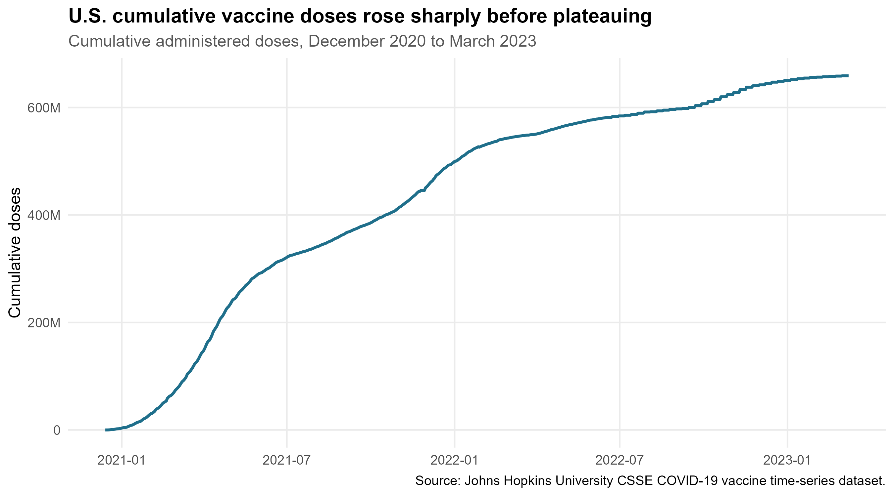
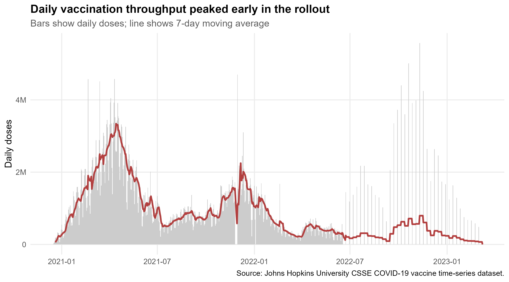
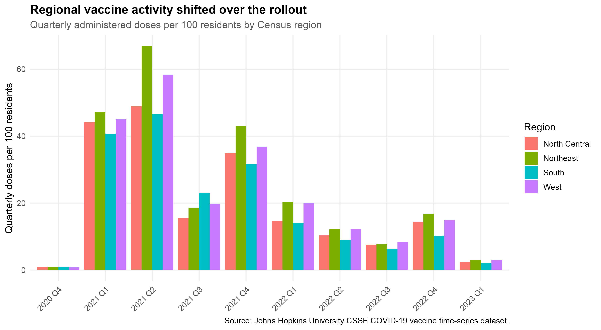

# COVID-19 Vaccine Logistics Analysis

An end-to-end R data analysis exploring the U.S. COVID-19 vaccine rollout and translating the results into logistics and operational-resilience insights for OmniVision Corporation.



## Project overview

This project analyzes state-level vaccine administration data from December 14, 2020, through March 9, 2023. The workflow reshapes a wide time-series dataset, calculates national and state-level measures, compares regional trends, and produces reproducible charts and tables for an executive report and presentation.

Key results include:

- Approximately 659 million doses were administered nationally by March 9, 2023.
- The rollout accelerated rapidly in early 2021 before slowing and rising again during booster periods.
- State outcomes varied substantially: the District of Columbia and Vermont recorded the highest doses per 100 residents, while Alabama and Mississippi were among the lowest.
- Regional differences support flexible capacity planning instead of relying on a single national forecast.

## Tools and skills demonstrated

- **R:** data cleaning, transformation, analysis, and automation
- **Tidyverse:** `dplyr`, `tidyr`, `readr`, `stringr`, and `ggplot2`
- **Time-series analysis:** daily changes, rolling averages, and milestone dates
- **Data visualization:** six publication-ready charts
- **Business communication:** executive report, supporting tables, and presentation
- **Reproducible workflows:** organized raw data, processed data, scripts, and outputs

## Featured visualizations

| National daily throughput | Regional quarterly comparison |
|---|---|
|  |  |

## Repository structure

```text
.
|-- data/
|   |-- raw/          # Source dataset
|   `-- processed/    # Analysis-ready datasets
|-- scripts/          # Ordered R workflow and document generators
|-- output/
|   |-- figures/      # Exported visualizations
|   `-- tables/       # Exported summary tables
`-- report/           # R Markdown and Word report deliverables
```

## Run the analysis

1. Install [R](https://cran.r-project.org/) and optionally [RStudio](https://posit.co/download/rstudio-desktop/).
2. Clone or download this repository.
3. Open `r-data-analysis-project.Rproj`.
4. Run the workflow from the project root:

```r
source("scripts/01_setup.R")
source("scripts/02_load_transform.R")
source("scripts/03_visualizations.R")
source("scripts/04_tables.R")
```

The setup script installs missing packages into the user R library. Generated figures and tables are written to `output/`.

## Data source

The analysis uses the Johns Hopkins University Center for Systems Science and Engineering COVID-19 vaccine time-series dataset. See the report for the full citation and methodological context.

## Notes

The analytical workflow, outputs, and conclusions should be reviewed before reuse. Source data is retained in the repository to make the analysis reproducible.
