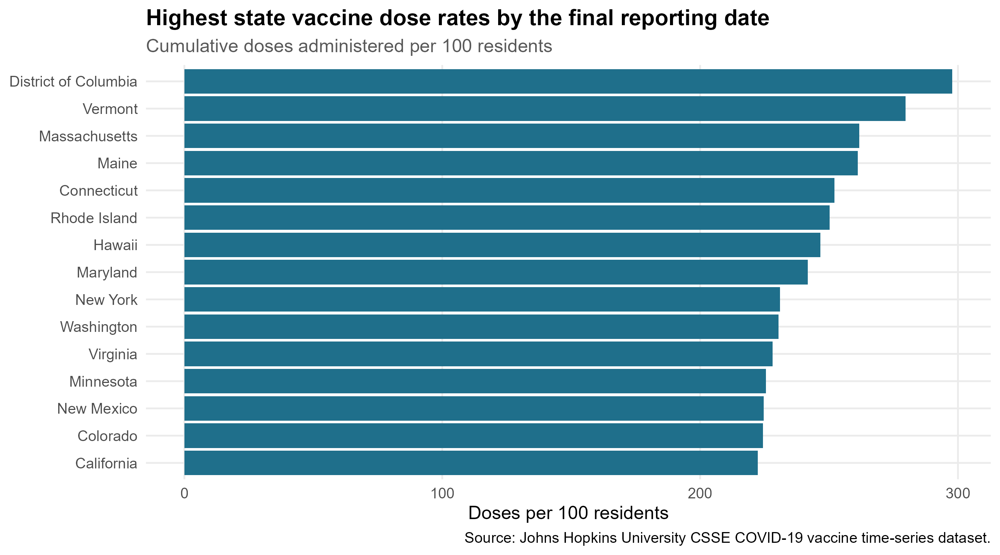
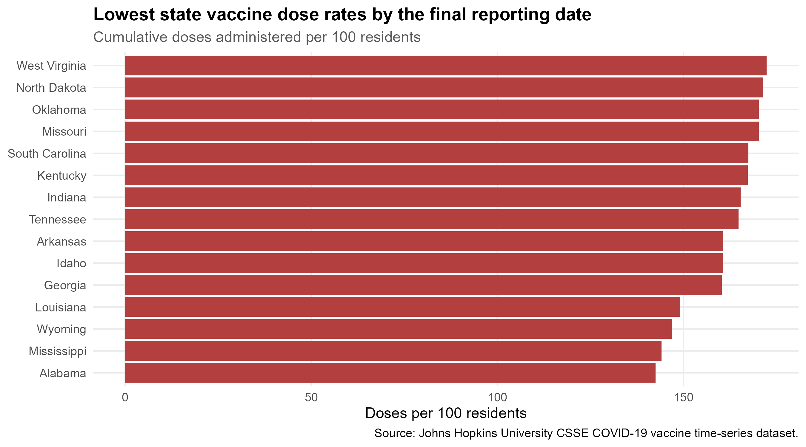
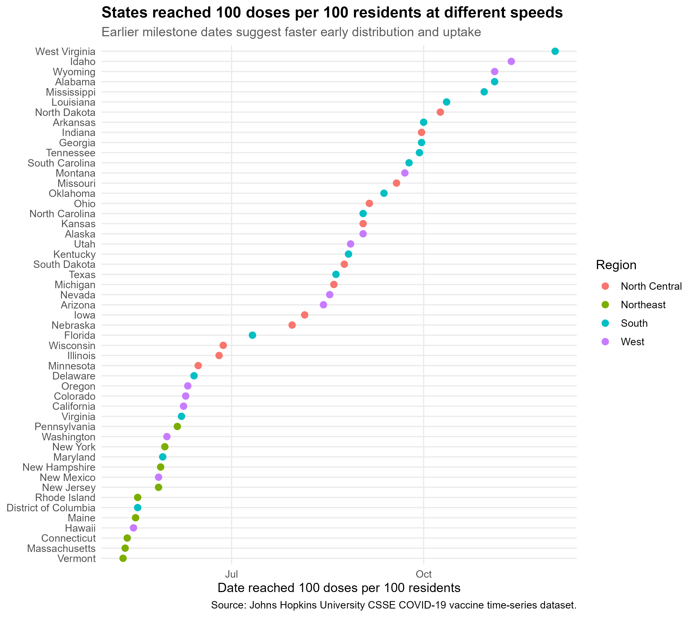

```{r setup, include=FALSE}
knitr::opts_chunk$set(echo = FALSE, warning = FALSE, message = FALSE)

project_root <- normalizePath(file.path(getwd(), ".."))
old_wd <- setwd(project_root)
source("scripts/04_tables.R")
setwd(old_wd)

fmt_num <- function(x) format(round(as.numeric(x), 1), big.mark = ",", scientific = FALSE)
fmt_int <- function(x) format(round(as.numeric(x), 0), big.mark = ",", scientific = FALSE)

latest_us <- dplyr::slice_tail(us_daily, n = 1)
peak_us <- us_daily |>
  dplyr::filter(!is.na(daily_doses_7day_avg)) |>
  dplyr::slice_max(daily_doses_7day_avg, n = 1)
```

\newpage

# Executive Summary

OmniVision Corporation is evaluating how major global disruptions may affect future logistics, market access, and operating resilience. This report examines the COVID-19 vaccine rollout in the United States as a case study in large-scale distribution under pressure. The analysis uses the Johns Hopkins University Center for Systems Science and Engineering COVID-19 vaccine time-series dataset, focusing on administered vaccine doses from December 14, 2020, through March 9, 2023.

The results show that the United States administered `r fmt_int(latest_us$cumulative_doses)` cumulative vaccine doses by the final reporting date, equal to approximately `r fmt_num(latest_us$doses_per_100)` doses per 100 residents. National throughput rose quickly in early 2021 and reached a seven-day average peak of about `r fmt_int(peak_us$daily_doses_7day_avg)` doses per day on `r format(as.Date(peak_us$date), "%B %d, %Y")`. After the initial rollout, activity slowed, then rose again during booster periods. State-level results were uneven: District of Columbia, Vermont, Massachusetts, Maine, and Connecticut had the highest cumulative dose rates, while Alabama, Mississippi, Wyoming, Louisiana, and Georgia were among the lowest by March 9, 2023.

For OmniVision, the vaccine rollout highlights three planning lessons. First, national demand shocks can create short windows where distribution capacity must scale rapidly. Second, regional variation matters: logistics plans should not assume uniform adoption, labor availability, or customer recovery across markets. Third, a resilient operating model requires flexible transportation partners, regional monitoring dashboards, and contingency planning for supplier, workforce, and inventory disruptions.

# Background and Business Context

COVID-19 created a global challenge that reached beyond public health. It affected labor availability, supplier reliability, transportation networks, customer demand, government policy, and the pace at which regions could reopen. Vaccine distribution became one of the clearest examples of how logistics capacity, public trust, infrastructure, and regional coordination can determine recovery speed.

Although OmniVision Corporation is not a vaccine distributor, the pattern is relevant to future opportunities and risk planning. A company that serves multiple regions must understand how quickly markets can recover from disruption, where demand may return first, and where logistics constraints may remain longer. Vaccine dose administration is a useful proxy for the broader ability of states and regions to coordinate supply, deliver services, and move through an emergency response cycle.

# Data and Method

This analysis uses the Johns Hopkins University Center for Systems Science and Engineering COVID-19 vaccine time-series dataset for U.S. administered vaccine doses. The original file contains state-level rows and daily cumulative dose columns. The R workflow reshaped the data into a tidy time-series format, filtered the analysis to the 50 states and District of Columbia, calculated daily dose changes, calculated doses per 100 residents, and summarized trends by state and U.S. Census region.

Six visualizations were generated in R using `ggplot2`. Three supporting tables were exported as CSV files and included in the report. The measures used in the analysis are cumulative administered doses, daily administered doses, seven-day moving average of daily doses, milestone dates for selected dose-per-population thresholds, and quarterly regional dose rates.

# Findings

## Visualization 1


Figure 1 shows a rapid increase in cumulative administered doses during the first half of 2021, followed by a slower increase and eventual plateau. This pattern suggests that crisis-driven demand and distribution activity were strongest during the initial rollout period. For OmniVision, the operational lesson is that large disruptions may require rapid capacity expansion early, followed by a shift toward maintenance, replacement, or booster-like demand cycles.

## Visualization 2


Figure 2 shows that daily vaccination throughput was highly concentrated in the early rollout. The seven-day moving average peaked at approximately `r fmt_int(peak_us$daily_doses_7day_avg)` doses per day on `r format(as.Date(peak_us$date), "%B %d, %Y")`. After that peak, daily activity became lower and more uneven. This is important for logistics planning because peak-period capacity requirements can be much higher than average-period requirements.

## Visualization 3



Figure 3 identifies the states and jurisdictions with the highest cumulative administered doses per 100 residents. District of Columbia led the dataset at 297.8 doses per 100 residents, followed by Vermont at 279.7, Massachusetts at 261.7, Maine at 261.1, and Connecticut at 252.2. These results indicate that some markets moved further through primary and booster dose cycles than others. For OmniVision, higher-performing regions may represent markets that recovered earlier or had stronger institutional capacity during the emergency.

## Visualization 4



Figure 4 shows the states with the lowest cumulative dose rates by March 9, 2023. Alabama recorded 142.5 doses per 100 residents, followed by Mississippi at 144.1, Wyoming at 146.8, Louisiana at 149.1, and Georgia at 160.3. These lower rates do not identify one cause by themselves, but they do show that emergency response outcomes differed substantially by state. For OmniVision, this supports regional scenario planning rather than a single national forecast.

## Visualization 5



Figure 5 compares how quickly states reached 100 administered doses per 100 residents. Vermont reached this milestone on May 10, 2021; Massachusetts followed on May 11, 2021; and Connecticut on May 12, 2021. Many other states reached the same threshold later. This timing gap matters because it shows that regions can move through disruption response at different speeds even when participating in the same national program.

## Visualization 6


Figure 6 shows that all regions experienced strong activity during 2021, especially in the second quarter. The Northeast recorded 66.8 quarterly doses per 100 residents in 2021 Q2, the West recorded 58.2, the North Central region recorded 49.0, and the South recorded 46.5. Regional activity declined in 2022, with smaller increases during later booster periods. For OmniVision, the result suggests that regional demand and operating conditions can shift quickly and should be monitored continuously.

# Supporting Tables

```{r table-1}
knitr::kable(
  head(table_1_latest_state_summary, 15),
  caption = "Table 1. Latest State-Level Vaccine Dose Summary"
)
```

Table 1 provides additional context for the state comparisons in Figures 3 and 4. It includes population, cumulative doses, and doses per 100 residents on the final reporting date. The table helps identify which high-performing states were small jurisdictions and which were large population centers.

```{r table-2}
knitr::kable(
  head(table_2_milestone_summary, 15),
  caption = "Table 2. State Milestone Timing Summary"
)
```

Table 2 supports Figure 5 by showing the dates when states reached 50, 100, and 150 doses per 100 residents. The milestone view is useful because it focuses on timing rather than only final totals.

```{r table-3}
knitr::kable(
  table_3_region_quarter_summary,
  caption = "Table 3. Quarterly Regional Dose Summary"
)
```

Table 3 supports Figure 6 by listing quarterly administered doses and normalized doses per 100 residents by region. The table shows that 2021 Q2 was the strongest quarter in every region, while later quarters were lower and more cyclical.

# Conclusions and Recommendations

The COVID-19 vaccine rollout demonstrates that large global challenges can create sudden surges in logistics demand, uneven regional recovery, and long tails of continuing operational activity. The initial rollout required rapid scaling, but the later booster periods required a different operating model: lower baseline volume, recurring demand, and persistent regional variation.

OmniVision should prepare for future opportunities with a flexible logistics model. The company should maintain relationships with multiple regional transportation and fulfillment partners, build dashboards that track market readiness indicators, and develop inventory plans that distinguish between surge demand and recurring demand. The company should also avoid treating the United States as one uniform market. The difference between high-dose-rate and low-dose-rate states shows that regional conditions can affect timing, workforce stability, customer access, and supplier reliability.

The recommended action is to create a disruption-response planning dashboard that combines public health, transportation, labor, supplier, and regional demand indicators. This would help OmniVision identify which markets are ready for expansion, which may require extra support, and where logistics constraints could affect future opportunities.

# Bias and Validation Note

Dataset limitations: This dataset reports administered vaccine doses, not individual vaccination completion, immune protection, or public health outcomes. Doses per 100 residents can exceed 100 because individuals may receive multiple doses and boosters. The data may include reporting delays, revisions, or differences in state reporting practices. This analysis also excludes U.S. territories and focuses only on the 50 states and District of Columbia, which limits geographic completeness. Finally, the dataset does not include demographic, socioeconomic, policy, or health-system variables that could explain why states differed.

Validation approach: The visualizations and tables were generated from the dataset using the R scripts in this repository. The workflow can be rerun in RStudio, the six figures and three tables can be regenerated, and selected report values can be compared against the exported CSV files.

# References

Dong, E., Du, H., & Gardner, L. (2020). An interactive web-based dashboard to track COVID-19 in real time. *The Lancet Infectious Diseases, 20*(5), 533-534. https://doi.org/10.1016/S1473-3099(20)30120-1

Johns Hopkins University Center for Systems Science and Engineering. (2023). *COVID-19 data repository*. GitHub. https://github.com/CSSEGISandData/COVID-19

